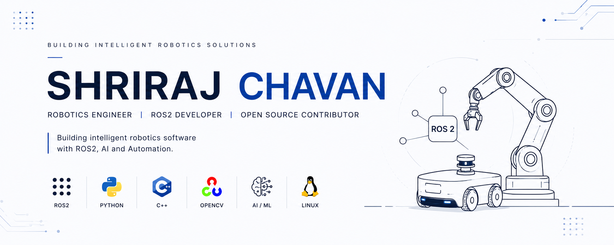

  

<h1 align="center">Hi 👋, I'm Shriraj Chavan</h1>

<h3 align="center">
Robotics & Automation Engineering Student • ROS2 Developer • Open Source Contributor
</h3>

Building intelligent robotics software with ROS2, AI, and Automation.

---

# 🚀 About Me

I'm a Robotics & Automation Engineering student passionate about developing intelligent robotics software and open-source tools.

My interests lie in **ROS2**, **Artificial Intelligence**, **Computer Vision**, **Autonomous Robotics**, and **Automation Systems**.

I enjoy building practical tools that simplify robotics development while continuously learning modern robotics software engineering.

---

# 🛠 Tech Stack

### 🤖 Robotics

- ROS2
- Gazebo
- RViz2
- OpenCV
- Computer Vision

### 💻 Programming

- Python
- C++
- Linux
- Git
- GitHub
- CMake
- Colcon

### 🧠 AI & Automation

- Artificial Intelligence
- YOLO
- Large Language Models (LLMs)
- Robotics Automation

---
# 🌟 Featured Projects

## 🩺 ROS2 AI Doctor

AI-powered debugging assistant for ROS2 developers that combines workspace analysis with evidence-based AI diagnosis to generate reliable recovery commands.

🔗 Repository  
https://github.com/shrirajchavan002-pixel/ROS2-AI-Doctor

---

## 🎯 Color Tracking Robot

A ROS2-based real-time color tracking system that leverages OpenCV for object detection and tracking. The project demonstrates image processing, robotic perception, and ROS2 communication for autonomous vision applications.

🔗 Repository  
https://github.com/shrirajchavan002-pixel/Color-tracking-ros2

---

## 🌱 Agrinova

AI-powered smart agriculture platform focused on crop monitoring, pest detection, and intelligent farming solutions using computer vision and automation.

---

## 🤖 Autonomous Robotics Projects

Building intelligent robotic systems using ROS2, simulation, perception, AI, and autonomous navigation technologies.

---

# 🌱 Currently Learning

- Advanced ROS2
- Robot Navigation
- Motion Planning
- Autonomous Mobile Robots
- AI for Robotics
- Open Source Development

---

# 🎯 Current Goals

✅ Contribute to Open Source Robotics

✅ Build Production-Ready ROS2 Applications

✅ Publish Robotics Developer Tools

✅ Learn Advanced Robotics Software Engineering

---

# 📈 Contribution Graph

---

# 📫 Connect With Me

💼 LinkedIn:
https://www.linkedin.com/in/shrirajchavan002/

💻 GitHub:
https://github.com/shrirajchavan002-pixel

---

⭐ Thanks for visiting my profile!

<b>Building intelligent robotics software, one project at a time.</b> 🚀

